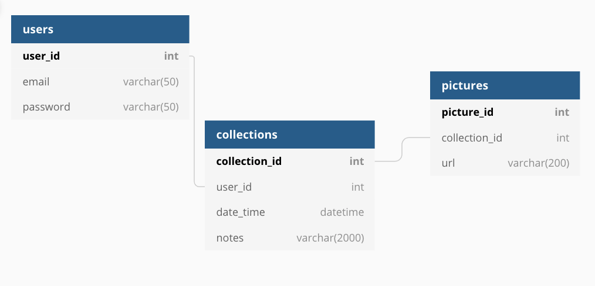
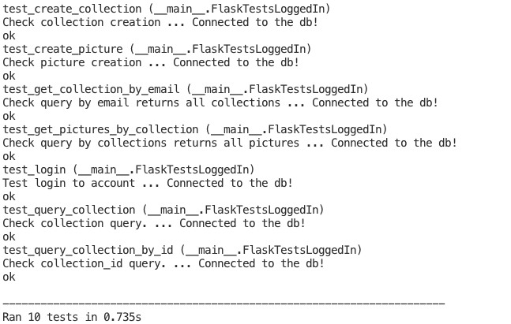
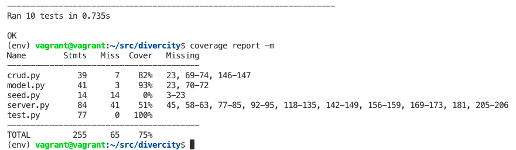

<!-- PROJECT LOGO -->
 

  

  <h3 align="center">Divercity</h3>

  

    This application allows you to create a visual resource for ethnicities in different places around the world. The project uses the Flickr api to generate the 100 most recent photographs from each query.  
     
     
     
    <a href="https://github.com/debiday/Divercity">View Demo</a>
    ·
    <a href="https://github.com/debiday/Divercity/issues">Report Bug</a>
    ·
    <a href="https://github.com/debiday/Divercity/issues">Request Feature</a>
  

<!-- ABOUT THE PROJECT -->
## About The Project

**Register**

**Search**
* Users can search for images and save them to a collection.

**Save**
* Users can revisit their curated collections from each city.

This project creates diverse selection of images that more accurately represent people who live in a city. This API produces a notably better selection of photos compared to many stock photo providers. Users can opt to personally contact the photographers on Flickr, or use this as a visual resource to understand the cultural diversity of places.

### Built With

* Python
* Javascript
* Flask
* Jinja
* SQLalchemy
* postgreSQL

APIs
* [Flickr](https://docs.mapbox.com/api/overview/)
* Google Places

Front-end
* Javascript
* JQuery
* AJAX
* Bootstrap
* HTML/ CSS

**DB Model**

<!-- ROADMAP -->
## Roadmap
### MVP
Users are able to query for images of people based on city. 

### 1.0 
* Create a search bar that allow user to search for people in a specific city
* Allow users to log into their own account to save pictures

### 2.0 - Current
* Allow users to save pictures to a specific collection
* Create functionality to add/delete photos for a curated collection
* Add google's autocomplete API for places

### 3.0 - The future
* Create resources for user to reach out to photographers
* Integrate API for stock photo choices (less diverse)
* Give users the choice to pay for licensed photos
* Allow users to share their collections with other users
* A zoomable world map that load related images on click

<!-- Installation -->
### Installation

1. `git clone` this repository 
2. `cd divercity` to go to the directory
3. `virtualenv env` to create a virtual environment
4. `source env/bin/activate` to activate it
5. `pip3 install -r requirements.txt` to install required packages
6. Sign up for an API key at [flickr API](https://www.flickr.com/services/apps/create/noncommercial/?) (You can enter "demo" for both boxes)
7. Create a new file called  `secrets.sh` in the Divercity directory
8. Save your API in this format 
`export API_KEY="xxxxx"/n
export API_SECRET="xxxxx"`
9. `source secrets.sh` back in the terminal
10. `python3 seed.py` to set up database
11. `python3 server.py` to launch and view on (http://localhost:5000/)! 

### Run Tests

1. `python3 test.py` to see individual tests
2. `coverage run --source=. --omit="env/*" test.py` to not test test.py file
2. `coverage report -m` to see a report

**Screenshot**

**Screenshot**

<!-- CONTACT -->
## Contact

Deborah Ong - [@debieday](https://twitter.com/debieday) - Deborah.oyt@gmail.com

Project Link: [https://github.com/debiday/Divercity](https://github.com/debiday/Divercity)

<!-- ACKNOWLEDGEMENTS -->
## Project for Fall 2021 Shopify Developer Internship

Fulfilled requirements of 

* Building an image repository 
* Including tests
* A search function from text
* Able to add image(s) to the repository
* Secure uploading and stored images with sessions

<!-- MARKDOWN LINKS & IMAGES -->
<!-- https://www.markdownguide.org/basic-syntax/#reference-style-links -->

[linkedin-shield]: https://img.shields.io/badge/-LinkedIn-black.svg?style=for-the-badge&logo=linkedin&colorB=555
[linkedin-url]: https://linkedin.com/in/debiday